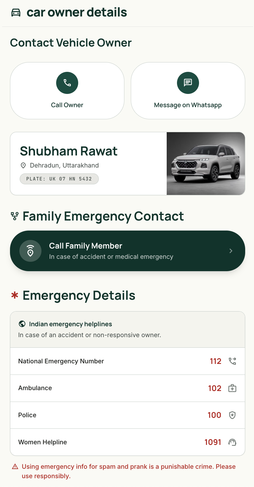

# 🚗 Car Owner Details Dashboard
A simple, elegant, and highly practical vehicle owner's dashboard. It serves as a digital business card for your car, perfect for linking to a QR code on your windshield or bumper so others can contact you if your car is blocked, parked incorrectly, or in an emergency.

## 🌟 Features
- Easy Contact: Allows others to quickly reach you without exposing your private phone directly.
- Emergency Ready: Dedicated sections for family and emergency contact information.

## 🚀 Quick Setup
Getting your own dashboard up and running takes less than five minutes.

1. Customize Your Details
Open the `data/user-details.json` file in your project folder and replace the placeholder information with your own. The dashboard will automatically update with your details!

2. Deploy for Free
Since this is a lightweight, static website, you can host it completely free on platforms like Vercel, Netlify, GitHub Pages.

----

----

💡 Tip: Once deployed, generate a QR code pointing to your live URL and print it out for your car's windshield!
